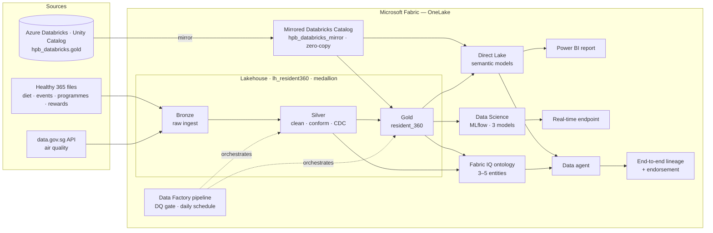

# HPB × Microsoft Fabric (+ Azure Databricks) — Full-Day Hands-On Workshop
## "Building a Resident 360 that makes Healthy 365 smarter — Fabric and Databricks, better together"

Over one day your team builds a **Resident 360 view** on Microsoft Fabric using the data behind HPB's flagship
**Healthy 365** app — while your existing estate stays in **Azure Databricks**. Every lab makes the Healthy 365
experience better for a real resident, and each layer builds on the one before.

> **Audience:** data engineers / analysts / data scientists who use Azure Databricks today.
> **Goal:** do what you do in Databricks, *in Fabric* — and see how the two coexist — with each step tied to a
> tangible improvement in the resident's app experience.

---

### Meet Rahim — why each lab matters

> **Rahim, 61, Woodlands.** He joined the **National Steps Challenge** but is drifting: he walks some days,
> rarely logs meals, skips outdoor events on hazy days, and dropped out of a programme. His last **health
> screening** flagged elevated glucose. Today Healthy 365 mostly "sees" his steps. Across the day we give the
> platform the layers it needs to understand Rahim, keep his data fresh and reliable, personalise his nudges in
> real time, and let HPB ask questions about residents like him.

```
Lab 0  Base Camp             → the ground it all stands on
Lab 1  One Resident, One View → unified foundation
Lab 2  See the Whole Person   → holistic, context-aware
Lab 3  Fresh Every Morning    → current & trustworthy
Lab 4  Never Drops a Step     → reliable & complete at national scale
Lab 5  Nudges That Land       → proactive, personalised, real-time
Lab 6  Just Ask               → explainable, conversational, governed
```
**The arc in six words:** *Unify → Understand → Refresh → Harden → Personalise → Converse.*

---

### The scenario

Healthy 365 captures **daily steps, MVPA, sleep, heart rate, SpO₂**, plus **meal logs**, **event bookings**,
**challenges** (National Steps Challenge, Eat Drink Shop Healthy), **programmes** (Healthier SG, I Quit),
**Healthpoints & eVouchers**, and **health-screening** results (Screen for Life). Today it's engineered in
Databricks. We bring it together in Fabric:



*All data is **synthetic** (no real residents / PII). Resident IDs (`RESIDENT_00001`…`RESIDENT_01500`) are
shared across Databricks and the Fabric uploads so every join works.*

> **Note:** Each lab's README opens with a **"Where this fits"** diagram showing the slice it builds and how it extends the
> previous lab toward this full architecture.

---

### Agenda (10:00 – 17:00, 1-hour lunch)

| Time | Lab | What the resident gets | Technical focus | HPB topic |
|------|-----|------------------------|-----------------|-----------|
| 10:00–10:15 | **Lab 0 · Base Camp** | (foundation) | Sign in to Fabric + shared Databricks, download the kit | prerequisites |
| 10:15–11:20 | **Lab 1 · One Resident, One View** | His data in one place + a talking agent | Workspace/Lakehouse, **Mirror** the estate (zero-copy), semantic model, report, **basic data agent** | #1 lineage (intro) |
| 11:20–12:05 | **Lab 2 · See the Whole Person** | Beyond steps — diet, events, programmes, rewards, environment | Ingest & harmonise uploads + API → Bronze | #5 DE features |
| 12:05–13:05 | 🍱 **Lunch** | | | |
| 13:05–13:55 | **Lab 3 · Fresh Every Morning** | Up-to-date, correct insights daily | Silver→Gold, pipeline + conditional triage, schedule | #2 orchestration, #5 |
| 13:55–14:40 | **Lab 4 · Never Drops a Step** | Reliable & complete at scale | Spark UI, resource prioritisation, monitoring dashboard, error logging, backfill | #3, #4, #6 |
| 14:40–14:50 | ☕ **Break** | | | |
| 14:50–15:35 | **Lab 5 · Nudges That Land** | A timely, personalised nudge | **3-model ML pipeline + tuning + MLflow** → real-time endpoint | ML |
| 15:35–16:20 | **Lab 6 · Just Ask** | Better programmes, trustworthy answers | 3 semantic models → **3-entity ontology** (extend to 5 in the challenge) → data agent + lineage | #1 lineage (capstone) |
| 16:20–16:50 | **Metadata-driven framework** | — | — | — |
| 16:50–17:00 | Wrap-up & next steps | | | |

### How the six HPB focus areas are covered
1. **Data lineage** (Databricks → Power BI): Lab 1 (intro) + Lab 6 (end-to-end capstone)
2. **Batch orchestration with conditional triage**: Lab 3
3. **Spark UI & cluster monitoring**: Lab 4 (+ Spark Monitoring KQL dashboard)
4. **Concurrent ETL + ad-hoc, resource prioritisation**: Lab 4 (custom pool / Autoscale Billing for Spark)
5. **Common DE features** (schema evolution, CDC, upsert, time travel, Spark config): Labs 2 & 3
6. **Debugging** (error logging, notifications, repair runs, backfill): Lab 4

---

### Folder map

| Folder | Lab | What's inside |
|--------|-----|---------------|
| [`lab0-prerequisites/`](lab0-prerequisites/README.md) | **Base Camp** | Accounts, tenant settings, login + download |
| [`lab1-connect-databricks/`](lab1-connect-databricks/README.md) | **One Resident, One View** | Mirror steps (the Databricks estate is pre-seeded by the facilitator) |
| [`lab2-ingest-harmonise/`](lab2-ingest-harmonise/README.md) | **See the Whole Person** | `data/` (upload files) · `notebooks/` (Bronze + API ingest) |
| [`lab3-transform-orchestrate/`](lab3-transform-orchestrate/README.md) | **Fresh Every Morning** | `notebooks/` (Silver, Gold, DQ gate) · pipeline steps |
| [`lab4-monitor-debug/`](lab4-monitor-debug/README.md) | **Never Drops a Step** | `notebooks/` (heavy job, error logging, backfill) |
| [`lab5-datascience-automl/`](lab5-datascience-automl/README.md) | **Nudges That Land** | `notebooks/` (train + tune models, call endpoint) |
| [`lab6-ontology-dataagent/`](lab6-ontology-dataagent/README.md) | **Just Ask** | `assets/` (semantic-model plan, ontology plan, agent questions) |

**Everything runs in the browser** — all code executes inside Fabric or Databricks notebooks. Start at
**[Lab 0 · Base Camp](lab0-prerequisites/README.md)**.

> **Get the kit:** click the green **`< > Code`** button above → **Download ZIP** (or
> `git clone https://github.com/ericshawtyz/resident-360-data-workshop.git`). Browse the labs right here on
> GitHub, or open the folder in VS Code — each lab is a `README.md` you read top to bottom.

> **Before any notebook:** attach the **`lh_resident360`** Lakehouse, and name your mirror exactly
> **`hpb_databricks_mirror`** so the kit notebooks work unchanged.
> **Challenges are optional.** **Fell behind?** Materialize the pre-built `resident_360_prebuilt` from the shared
> estate into your own `gold` schema (one Spark cell — see Lab 3); the facilitator calls re-sync points at the
> end of Lab 3 and Lab 5.

---

### Data
All data is **synthetic** — no real residents or personal data (PII).
