[← Workshop home](../README.md)

# Lab 1 · Build the Resident 360
## Medallion end-to-end — mirror, ingest, transform, observe

**⏱ 90 min**  ·  **🎯 Focus:** #1 lineage (intro) · #2 orchestration · #3 Spark UI · #4 resource prioritisation · #5 DE features

### The story
Rahim's steps live in **Databricks**; his meals, events, programmes, rewards and the day's air quality are scattered
across app files and a public API. Today you bring it **all together in Fabric** — without moving the Databricks
estate — into a single **Resident 360** view, and you watch how Spark builds it.

### You'll build
- One **Lakehouse** (`lh_resident360`) with three schemas — **`bronze` → `silver` → `gold`**.
- A **zero-copy mirror** of the shared Databricks estate (`hpb_databricks_mirror`).
- The full medallion in **one well-documented notebook**: ingest app files + a live API → Bronze, clean → Silver,
  join with the mirror → **`gold.resident_360`** — trying **Data Wrangler** and **Copilot agent mode** along the way.
- A Direct Lake **semantic model** and a **Copilot-generated report**.
- Hands-on **Spark UI, resource prioritisation and monitoring** while your jobs run.

### Where this fits

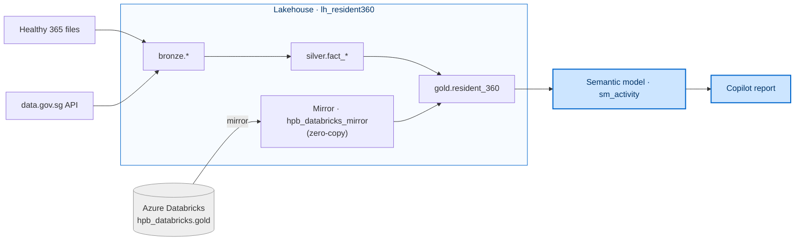

**Builds on:** the pre-seeded Databricks estate. Everything in Labs 2–4 extends the medallion you build here.

### Files
- `data/` — the seven Healthy 365 files you upload to the Lakehouse.
- `notebooks/resident360_medallion.ipynb` — the **one** end-to-end notebook (Bronze → Silver → Gold + observability).

> **New to Fabric?** Every screen is pictured below. If a button hides behind a **⋯ (More options)** menu or the
> window feels cramped, **maximise your browser** — Fabric hides ribbon buttons on narrow windows.

---

### Task 1 — Workspace, Lakehouse & mirror the Databricks estate

**A Lakehouse** is the storage container for all your tables; **mirroring** brings the Databricks `gold` tables into
Fabric with **zero copies** (Fabric reads them live).

1. Open your assigned workspace **`HPB Workshop - <Your Name>`**. On the toolbar click **+ New item**.

   > **Note:** a fresh workspace opens on a **"predesigned task flow"** panel at the top — ignore it. Everything in
   > this lab starts from the **+ New item** button on the toolbar.

   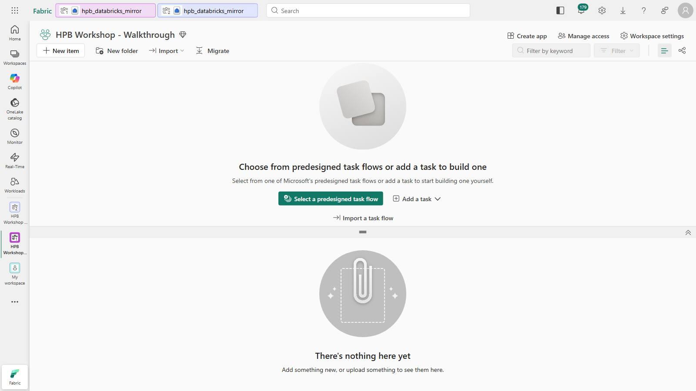

2. In the panel, search `lakehouse` and click the **Lakehouse** tile.

   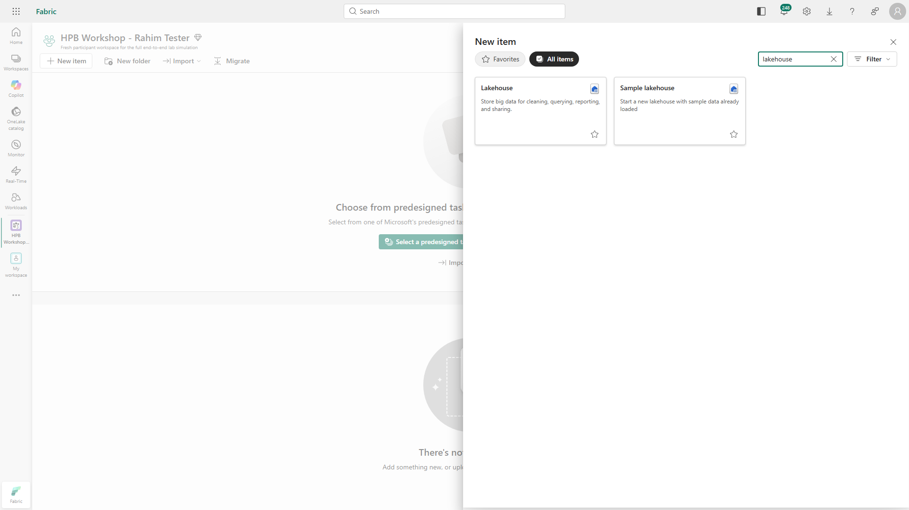

3. Name it **`lh_resident360`**, keep **Lakehouse schemas** ticked, click **Create**.

   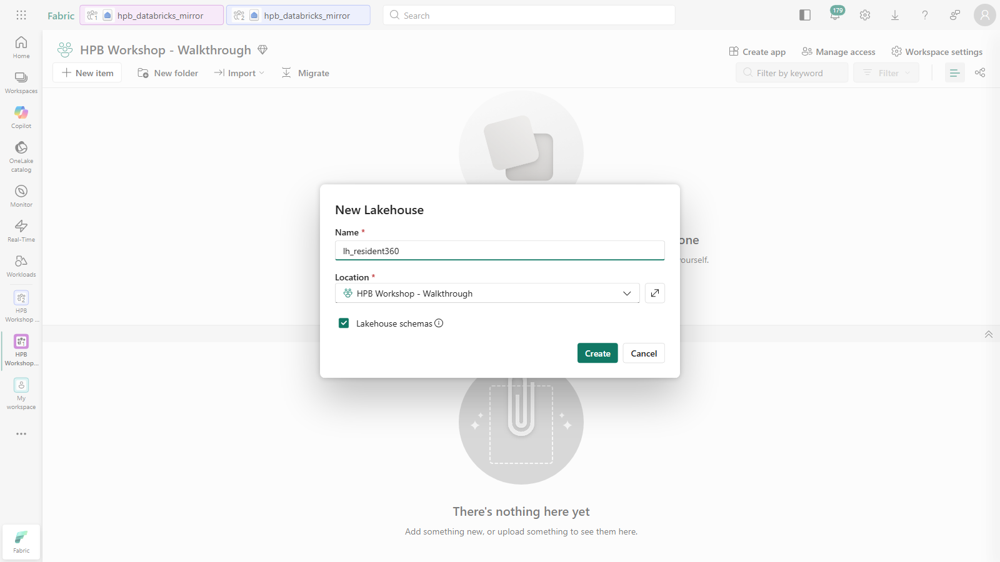

4. Back in the workspace, click **+ New item** again → search `Mirrored Azure Databricks` → click the
   **Mirrored Azure Databricks catalog** tile.

   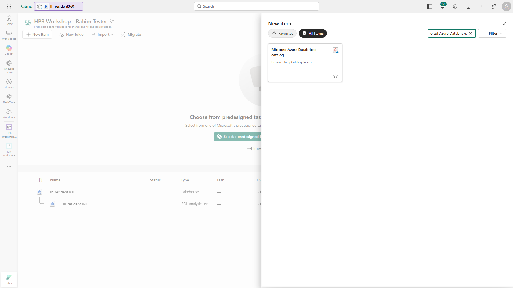

5. In the wizard, keep **Existing connection** and open the **connection** dropdown. Pick the shared Databricks
   connection — it's listed by its **workspace URL** (e.g. `https://adb-....azuredatabricks.net`) with your username,
   **not** a friendly "workshop" name.
   - **If the dropdown is empty** (first-time use), choose **New connection**, paste the shared **Databricks workspace
     URL** the facilitator gives you, keep the default auth, and sign in.

   Then **Next** → choose catalog **`hpb_databricks`**, tick the **`gold`** schema → **Next**.

   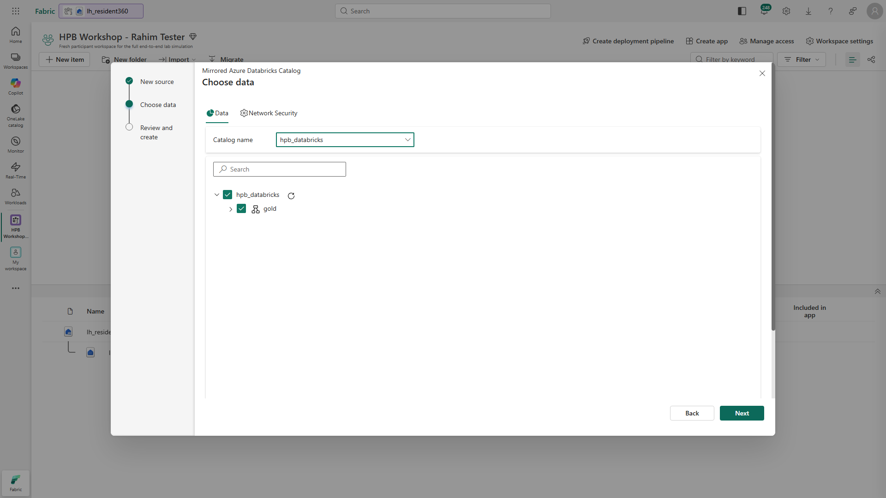

6. On **Review and create**, change the **Name** to exactly **`hpb_databricks_mirror`** → **Create**.

   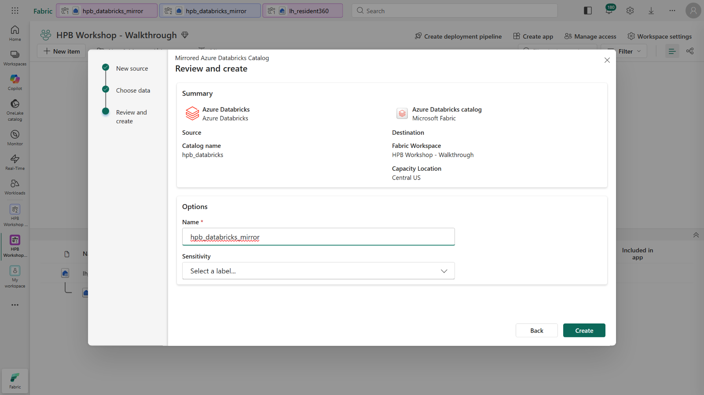

   > ⚠️ The name **must** be `hpb_databricks_mirror` (with the `_mirror` suffix) — the notebook refers to it by this
   > exact name. If sign-in ever says *"Sign in canceled,"* click **Sign in** again (1–3 tries).

7. The `gold` tables sync in 1–3 min. **Verify (zero-copy):** open the mirror → **SQL analytics endpoint** →
   **New SQL query** → `SELECT COUNT(*) FROM hpb_databricks_mirror.gold.dim_resident;` → expect **1500**.

> **Note:** don't shortcut the mirror into a `gold`/`silver`/`bronze` schema of `lh_resident360` — a read-only shortcut
> collides with the writable medallion you build next. The notebook reads the mirror directly instead.

---

### Task 2 — Upload the files & run the medallion notebook

This is the heart of the lab: land the raw files, then run **one notebook** that builds Bronze → Silver → Gold.

#### 2a · Upload the seven app files to `Files/landing/`

1. Open **`lh_resident360`**. Hover the **Files** node → **⋯ (More options)** → **New subfolder** → name it **`landing`**.

   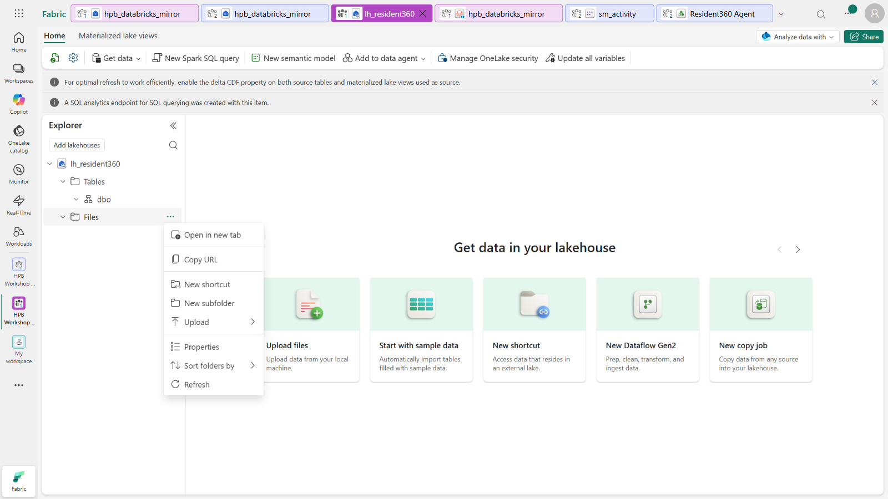

2. Hover **`landing`** → **⋯** → **Upload → Upload files** → select **all seven files** from the kit's `data/` folder →
   **Upload**. Confirm the folder shows *"Files 7"*.

   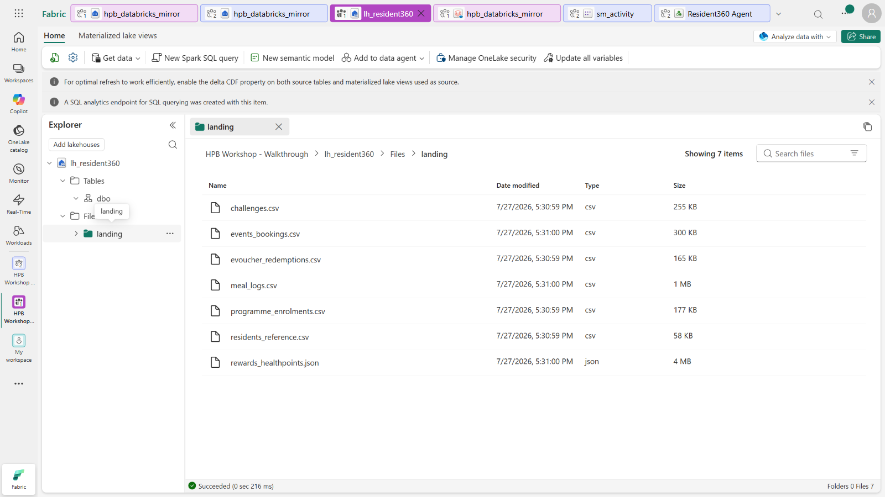

#### 2b · Import & attach the notebook

3. Workspace toolbar → **Import → Notebook → From this computer** → pick
   **`resident360_medallion.ipynb`** from the kit's `notebooks/` folder.

   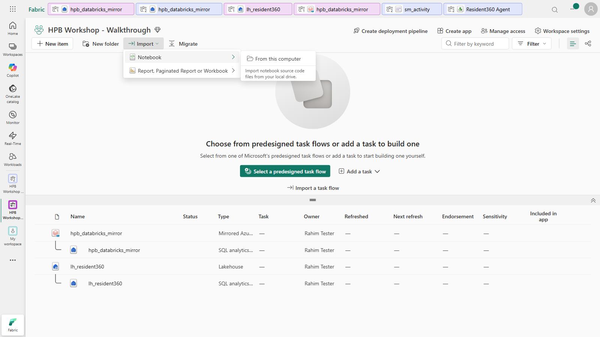

4. Open the notebook → Explorer **Add data items → From OneLake catalog** → tick your **`lh_resident360`**
   **Lakehouse** (the one whose Location is your workspace — **not** its SQL analytics endpoint) → **Add**.

   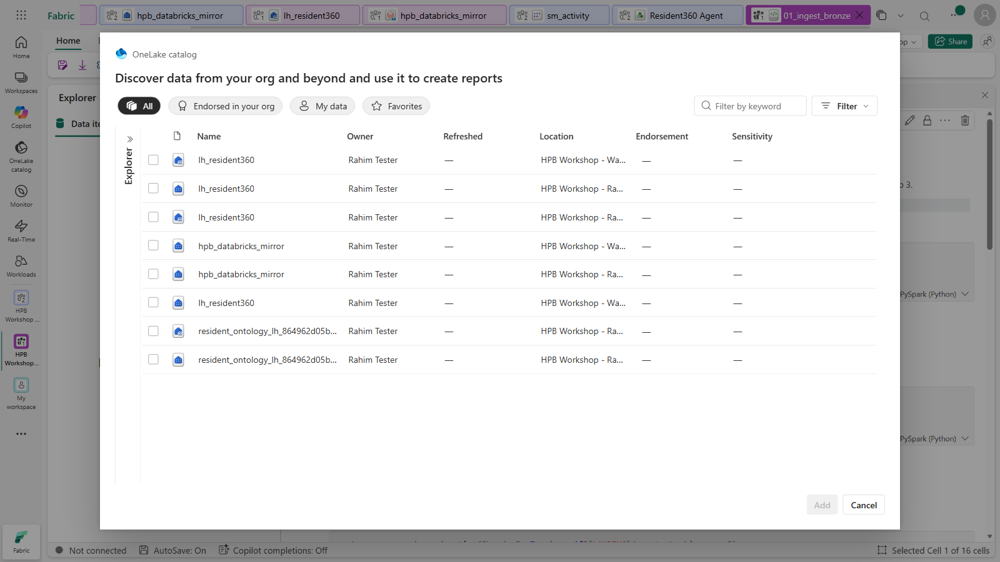

   > ⚠️ The picker lists `lh_resident360` more than once. Pick the **Lakehouse** — it's the one that can read
   > `Files/landing/` and write tables. The SQL endpoint can't write, so the run would fail.

#### 2c · Run it — and try Data Wrangler, observability & Copilot

5. Read each section's markdown, then **Run all** (first run starts a Spark session, ~1–3 min). Watch the layers
   appear under **Tables**: `bronze.*` → `silver.fact_*` → `gold.resident_360`.

   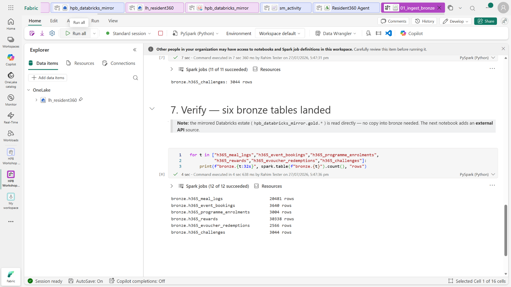

6. **Data Wrangler (Section 1).** After Bronze lands, open `bronze.h365_meal_logs` in **Data Wrangler** (Explorer ⋯ →
   *Open in Data Wrangler*), try **Drop missing values** on `calories` and a type cast, then **Add code to notebook** —
   see how clicks become code. *(Silver does the authoritative cleaning; this is just to experience the tool.)*

7. **Observability (Section 6).** Run the **skewed** then **tuned** cells and compare them in the **Spark jobs** view
   and the **Monitor** hub — one long task vs. many short parallel tasks. Note the **resource-prioritisation** guidance.

8. **Copilot agent mode (Section 7).** Open **Copilot** in the toolbar, switch to **agent mode**, and ask it to profile
   or chart `gold.resident_360`. Watch it plan → generate → run.

> **Done when you see:** `bronze.*` (6 tables + `env_air_quality`), `silver.fact_*` (6), and **`gold.resident_360`**
> (1,500 rows) with an `is_disengaged` split of **roughly 12% disengaged** (about 180 of 1,500 residents flagged `1`).

---

### Task 3 — Semantic model

A **semantic model** is the layer reports and (later) the data agent read from. You'll compare it against an **ontology**
in Lab 4 — so build it now.

1. Open the mirror's **SQL analytics endpoint** (or the Lakehouse's) → ribbon **New semantic model** → name it
   **`sm_activity`** → tick **`dim_resident`** and **`daily_activity`** → **Confirm**.

   > ⚠️ Make sure **both** `dim_resident` **and** `daily_activity` show a tick before you click **Confirm** — it's easy
   > to miss one. If you end up with only one table, add the other later via **Model view → Editing → Edit tables**.

   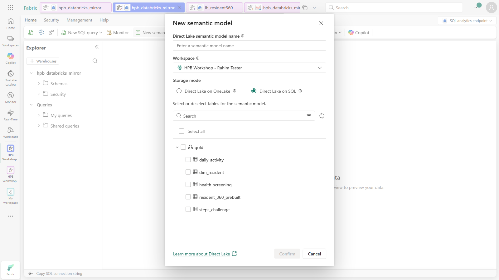

2. In the **Model view** (switch **Viewing → Editing** if needed) → **Manage relationships → New relationship**:
   `daily_activity(resident_id)` → `dim_resident(resident_id)`, **Many-to-one**, **Single** → **Save**.

   > **Note:** switching to **Editing** on a Direct Lake model shows a one-time *"Converting semantic model…"* message
   > (~10 sec) — that's expected. Direct Lake also notes that cardinality/cross-filter are **inferred** and may need a
   > manual check; here it correctly detects **Many-to-one / Single**.

   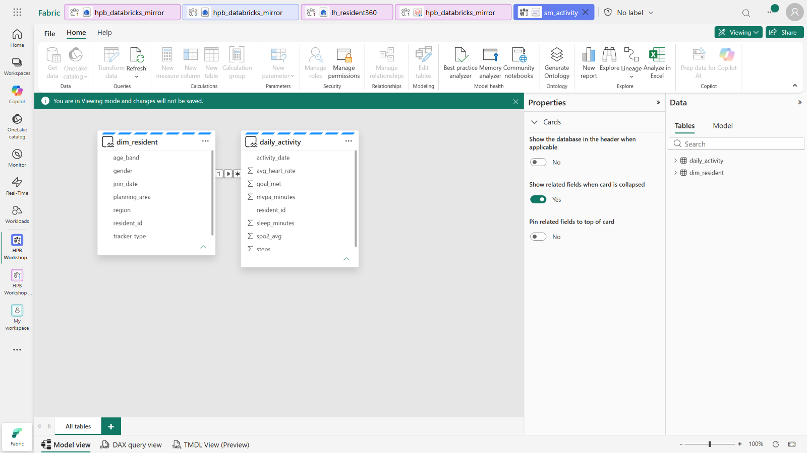

---

### Task 4 — Let Copilot build the report

Instead of hand-placing visuals, let **Copilot** suggest and build the report pages for you.

1. In the workspace list (or from the semantic model), open **`sm_activity` → ⋯ (More options) → Create report**.
   This opens the report editor bound to `sm_activity` (both tables appear in the **Data** pane).
   > *Tip:* the model view also has a **New report** button, but the **⋯ → Create report** path from the list is the
   > most reliable.
2. In the report editor, click **Copilot** in the toolbar → choose **Suggest content for a new report page**. Copilot
   proposes an outline of pages (e.g. *Resident activity overview*, *Engagement by demographic segment*, *Activity
   trends over time*, *Sleep and recovery analysis*).
3. Click **Create** under a page you like — Copilot builds the page and lays out the visuals for you. Repeat for any
   other pages, then **Save** the report as **`rpt_activity`**.

   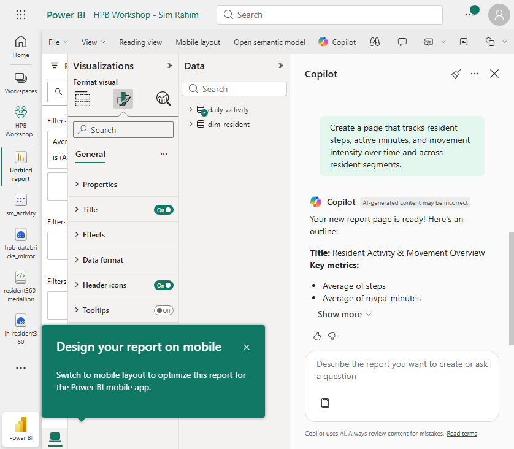

> **Done when you see:** a report Copilot built from your semantic model — no manual visual placement. *(Copilot drafts
> may briefly show an axis warning on a visual until the fields settle — that's normal.)*

---

### ✅ Checkpoint
- [ ] `lh_resident360` Lakehouse + `hpb_databricks_mirror` (zero-copy count = 1500)
- [ ] `bronze.*`, `silver.fact_*`, and `gold.resident_360` all created by the one notebook
- [ ] Tried **Data Wrangler**, the **Spark UI / Monitor**, and **Copilot agent mode**
- [ ] `sm_activity` semantic model + a **Copilot-built** report

### 🟡 Challenge (optional)
- **Fell behind?** Materialize the pre-built `resident_360_prebuilt` from the shared estate into your own `gold` schema
  (one Spark cell) and continue.
- Enforce an explicit schema in the Bronze reads and route bad rows to a `bronze.h365_meal_logs_rejects` table.
- Ask Copilot (agent mode) to add a **data-quality summary** cell over `gold.resident_360`.

---

### Next up
**[Lab 2 · Metadata-Driven Lakehouse](../lab2-metadata-lakehouse/README.md)**
