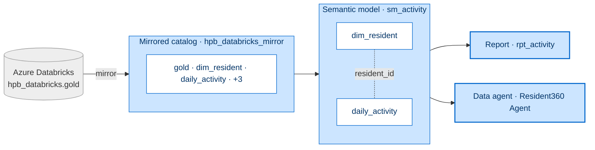

[← Workshop home](../README.md)

# Lab 1 · One Resident, One View
## Set up, mirror & your first AI win

**⏱ 65 min**  ·  **🎯 Focus:** #1 Data lineage (intro)

### The story
Rahim's activity and screening history already live in Databricks. We bring them into Fabric with **zero copies**
and stand up a **data agent** that can answer questions on day one — the baseline we'll later beat with an
ontology in Lab 6.

### You'll build
- A Fabric workspace + `lh_resident360` Lakehouse.
- A **zero-copy mirror** of the shared Databricks estate.
- A Direct Lake **semantic model** + report.
- A **basic data agent** (Lab 6 baseline).

### Where this fits



**Builds on:** the pre-seeded Databricks estate. Everything in Labs 2–6 extends this foundation.

### Files
- None in this lab — the shared Databricks estate is **pre-seeded** and ready; you connect to it via the mirror in Task 3.

---

### Task 1 — Open your workspace + create the Lakehouse
1. Go to **Workspaces** and open your **assigned workshop workspace** (pre-provisioned with Fabric capacity).
2. Select **+ New item → Lakehouse** → name **`lh_resident360`** → keep **Lakehouse schemas** enabled → **Create**.

### Task 2 — Confirm the shared estate
1. In **Databricks → Catalog**, expand **`hpb_databricks → gold`** and confirm these five tables:
   - `dim_resident` — 1,500 rows
   - `daily_activity` — includes a deliberate May-2026 gap
   - `steps_challenge`
   - `health_screening`
   - `resident_360_prebuilt` — catch-up fallback

> **Note:** The estate is shared and read-only — seeded once for the room.

### Task 3 — Mirror the Unity Catalog
1. Select **+ New item** → search **Mirrored Azure Databricks catalog** → in the **New source** dialog keep
   **Existing connection** and pick the shared workshop connection from the dropdown (or choose **New connection**
   → Databricks URL → **Authentication: Organizational account** → **Sign in**) → **Next**.
2. Select catalog **`hpb_databricks`** → tick the **`gold`** schema → keep **Automatically sync future changes** on →
   **Review → Create**.

> **Note:** Name the mirror exactly `hpb_databricks_mirror`. The Review step defaults the Name box to
> `hpb_databricks`; you **must** change it. Every kit notebook depends on this name.
> If sign-in says *"Sign in canceled"*, just click **Sign in** again (1–3 tries).

3. **Verify (zero-copy):** open the mirror → **SQL analytics endpoint** →
   `SELECT COUNT(*) FROM hpb_databricks_mirror.gold.dim_resident;` → expect **1500**.

> **Note:** Do NOT shortcut the mirror into a `gold`/`silver`/`bronze` schema of `lh_resident360`. A
> mirror shortcut is read-only and collides with the writable medallion you build in Labs 2–3 (causes a 403 in
> Lab 3). Build the semantic model directly on the mirror instead (Task 4).

### Task 4 — Semantic model + report
1. Open the mirror → **SQL analytics endpoint → New semantic model** on **`dim_resident` + `daily_activity`** → name **`sm_activity`** → **Confirm**.
2. Open the model → **Manage relationships → New relationship**: `daily_activity(resident_id)` → `dim_resident(resident_id)`, **Many-to-one**, **Single** → **Save**.
3. Select **New report** → bar chart (Axis `region`, Value avg `steps`). **Click an empty part of the canvas to
   deselect the bar chart**, then add a **card** (avg `mvpa_minutes`) → **Save** as `rpt_activity`.

> **Done when you see:** a bar chart of ~6,900 avg steps per region plus a single-value MVPA card.

> **Note:**
> - The model may open in **Viewing** mode, which greys out **Manage relationships** even when both tables are present. Switch to **Editing** first (top-right **Edit** button).
> - If the model opens with only `dim_resident`, use ribbon **Edit tables** to re-add `daily_activity`, then reload — **Manage relationships** stays greyed until both tables are present.
> - Report authoring opens a new tab (if prompted, pick your account); dismiss the Copilot "Try it" bubble as it blocks clicks.
> - In the Data pane click a field's **checkbox** (not the row). Numeric fields default to **Sum** — switch to **Average** via the field-chip menu.

### Task 5 — Basic data agent (your first AI win)
1. Select **+ New item → Data agent** → name **`Resident360 Agent`**.
2. Select **Add data → Data source** → choose **`sm_activity`** → **Add**.
3. In the schema browser, **tick `daily_activity` and `dim_resident`** — they aren't selected automatically (the agent warns "No tables selected yet").
4. Open **Agent instructions** (toolbar) → paste the brief below — it pins the aggregation so the agent averages (not sums) by default:
   ```
   You answer questions about resident activity for HPB using the sm_activity semantic model.
   - dim_resident: one row per resident (region, planning_area, age_band, gender, tracker_type; key resident_id).
   - daily_activity: one row per resident per day (steps, mvpa_minutes, sleep_minutes, avg_heart_rate, spo2_avg, goal_met). Join on resident_id.
   - Default aggregation is AVERAGE. For any metric "by <category>" (e.g. steps by region), return the average per resident per day — never a sum/total — unless the user explicitly asks for a total.
   - MVPA = moderate-to-vigorous minutes per day. Report by group (region, age band), never individual resident IDs.
   - Format numbers with thousands separators and offer a column chart for by-category questions.
   ```
5. **Ask** *"What is the average number of steps by region?"* → expect a ranked list (~6,900/region) plus an auto-generated column chart (~20–30 s).
6. **Publish** (toolbar; add a one-line description) so the agent is reusable.

> **Remember this agent.** In Lab 6 you'll build an ontology-backed agent over the same data and compare — the ontology wins on relationship-aware, multi-hop questions.

---

### ✅ Checkpoint
- [ ] Workspace + Lakehouse created
- [ ] Mirror returns the zero-copy count (`dim_resident` = 1500); **no `gold` shortcut created**
- [ ] Direct Lake report renders; basic data agent answering questions

### 🟡 Challenge (optional) — add a mini-ontology
1. Select **+ New item → Ontology (preview)** → name **`resident_mini_ontology`**.
2. Add entity **Resident** (key `resident_id`) and bind it to the mirror's `dim_resident`.
3. Add entity **Region** (key `region`) and bind it to `dim_resident`.
4. Add relationship **Resident —livesIn→ Region**, then open its edge and map `resident_id → region` via `dim_resident`.
5. Open **Resident360 Agent → Add data → Data source** and add the ontology.
6. Ask *"Which region has the most residents, and their average steps?"* and compare with the flat agent.

---

### Next up
**[Lab 2 · See the Whole Person](../lab2-ingest-harmonise/README.md)**

