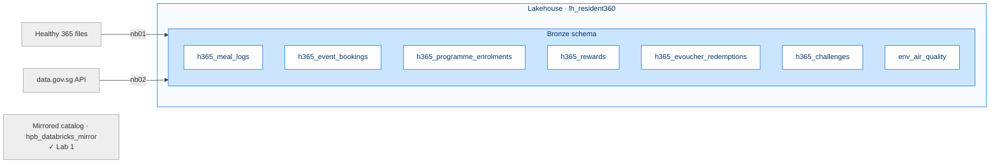

[← Workshop home](../README.md)

# Lab 2 · See the Whole Person
## Ingest & harmonise into Bronze

**⏱ 45 min**  ·  **🎯 Focus:** #5 Common DE features

### The story
Beyond steps: the profile now learns Rahim's meals, events, programmes, rewards, eVouchers, challenges — and
the air quality on days he skips a walk. The app starts to see the **whole person**.

### You'll build
- Six **Bronze** tables from uploaded Healthy 365 files.
- One **Bronze** table from a live **open-data API** (air quality).

### Where this fits

**Builds on:** Lab 1's mirror. Adds the raw app + environment data that Lab 3 will clean.

### Files
- `data/` — upload to the Lakehouse:
  - `meal_logs.csv` — diet *(a few dirty rows on purpose)*
  - `events_bookings.csv` — event/class bookings + attendance
  - `programme_enrolments.csv` — Healthier SG, EDSH, I Quit, …
  - `rewards_healthpoints.json` — Healthpoints ledger
  - `evoucher_redemptions.csv` — Healthpoints → merchant vouchers
  - `challenges.csv` — National Steps Challenge, Eat Drink Shop Healthy participation
  - `residents_reference.csv` — indicative resident list (authoritative demographics live in Databricks)
- `notebooks/01_ingest_bronze.ipynb` — lands the uploads into Bronze
- `notebooks/02_api_ingest_datagovsg.ipynb` — pulls the air-quality API into Bronze

> Import notebooks via **Workspace → Import → Notebook → From this computer**. After import, attach the
> Lakehouse: **Explorer → Add data items → From OneLake catalog → `lh_resident360` (Lakehouse type)**.

---

### Task 1 — Upload the Healthy 365 files
1. Open Lakehouse **`lh_resident360`** → **Files** → **… → New subfolder** → name **`landing`**.
2. Select `landing` → **… → Upload → Upload files** → upload **all files** from `data/` (seven files).
3. Confirm they appear under **Files/landing/**.

> **Note:** `01_ingest_bronze` lands **six** of them as `bronze.h365_*` tables. `residents_reference.csv` is **not**
> ingested here — it's an indicative list kept for reference (authoritative demographics live in Databricks).

### Task 2 — Run the Bronze ingest notebook
1. Import and open **`01_ingest_bronze`**; attach the **`lh_resident360`** Lakehouse.

> **Note:** the picker lists `lh_resident360` twice — pick the **Lakehouse** entry (not the SQL analytics
> endpoint), which is the one that lets the notebook read `Files/landing/` and write tables.

2. **Run all.** It creates six `bronze.h365_*` tables:
   - `h365_meal_logs`
   - `h365_event_bookings`
   - `h365_programme_enrolments`
   - `h365_rewards`
   - `h365_evoucher_redemptions`
   - `h365_challenges`

> **Done when you see:** six `bronze.h365_*` tables under the `bronze` schema (refresh **Tables** to confirm).

### Task 3 — Ingest the air-quality API
1. Open **`02_api_ingest_datagovsg`**, attach the Lakehouse, **Run all**.
2. It calls the public **data.gov.sg** PSI endpoint and writes **`bronze.env_air_quality`** (falls back to safe
   values if the API is unreachable).

> **Done when you see:** `bronze.env_air_quality` with **5 rows** (one per region). Lab 3 folds this into the
> Gold table as `region_psi` / `region_is_hazy`.

### Task 4 — Preview what you landed
1. In `lh_resident360` → **Tables**, refresh and expand **`bronze`**.
2. Right-click any table → **View data**. Note the meal-log table has a few dirty rows (blank `calories`, an
   invalid date) — you'll gate these in Lab 3.

> **Fun fact:** the mirrored Databricks estate is read directly — no copy into Bronze needed. Bronze is only for
> the *new* app files and the API.

---

### ✅ Checkpoint
- [ ] All seven kit files uploaded to `Files/landing/`
- [ ] Six `bronze.h365_*` tables created
- [ ] `bronze.env_air_quality` created from the API

### 🟡 Challenge (optional) — re-ingest with a Dataflow Gen2
1. Select **+ New item → Dataflow Gen2** → **Get data → Lakehouse** → `lh_resident360` → `Files/landing/meal_logs.csv`.
2. In Power Query, set column data types and filter out rows with blank `calories`.
3. Set the **data destination** to `lh_resident360` (new table `bronze.h365_meal_logs_df`) → **Publish**.
4. Compare its row count and schema with the notebook's `bronze.h365_meal_logs`.

**Other idea:** enforce an explicit schema in the notebook and route bad rows to a `bronze.h365_meal_logs_rejects` table.

---

### Next up
**[Lab 3 · Fresh Every Morning](../lab3-transform-orchestrate/README.md)**

