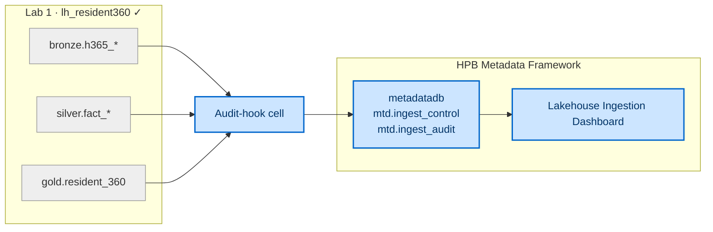

[← Workshop home](../README.md)

# Lab 2 · Govern & Trace

## Metadata-driven lakehouse — observability & traceability

**⏱ 60 min**  ·  **🎯 Focus:** #6 Data quality & traceability

### The story

In Lab 1 you built the Resident 360 medallion by hand. In production, HPB runs **hundreds** of such
loads — and needs to answer, at a glance: *did every load succeed? how many rows moved? how long did it
take? is the data consistent?* That's what a **metadata-driven lakehouse** gives you: a small **control +
audit database** (`metadatadb`) that every load reports into, and a **dashboard** that turns those rows
into observability and traceability — over a medallion that follows the exact bronze → silver → gold
pattern you just built.

You won't build the framework from scratch (that's a facilitator preflight — see
`assets/PROVISIONING-RUNBOOK.md`). Instead you'll **connect your Lab 1 medallion to it** and watch your
own transform runs surface in the governance dashboard.

### You'll do

- Register your Lab 1 tables in the framework's **control** table.
- Add **one audit-hook cell** to your Lab 1 notebook so each run reports into `metadatadb`.
- Open the **Lakehouse Ingestion Dashboard** and read the observability + traceability story for **your** load.
- Inspect the **control** and **audit** tables to see the config-driven pattern.

### Where this fits



**Builds on:** the medallion from Lab 1. Everything here reports on tables you already created.

### Files

- `assets/audit-hook-cell.py` — the cell you paste at the end of your Lab 1 notebook.
- `assets/PROVISIONING-RUNBOOK.md` — *facilitator only*: how the framework was deployed (`metadatadb`,
  lakehouses, pipelines, dashboard). Read this only if you're setting the framework up.

> **New to Fabric?** Each step is small and self-contained — just follow them in order.

---

### Task 1 — See the framework's brain: the control table

The framework is driven by a config table — no hard-coded pipelines.

1. In the browser, open the shared **`HPB Metadata Framework`** workspace (the facilitator will share the link).
2. Open **`metadatadb`** (the Fabric **SQL Database**).
3. In its query editor, run:

   ```sql
   SELECT source_schema_name, source_table_name, load_type, target_object, enable_flag
   FROM mtd.ingest_control
   ORDER BY source_schema_name, source_table_name;
   ```

4. Notice the rows describe **your** medallion tables — `bronze.h365_*`, `silver.fact_*`, `gold.resident_360` —
   each with its **load type** (Full / Incr) and **target**. This config *is* the framework: add a row, and
   a new table is governed. No code change.

> **Done when you see:** five control rows naming your bronze / silver / gold tables.

---

### Task 2 — Connect your Lab 1 notebook to the audit store

Now make your transform **report** each run into the framework.

1. Go back to **your** workspace and open your **Lab 1 medallion notebook** (`resident360_medallion`).
2. **Add a new cell at the very end.**
3. Open `assets/audit-hook-cell.py`, copy its full contents, and paste them into that cell.
4. Confirm the `SQL_SERVER` and `SQL_DB` values at the top match the facilitator's `metadatadb`
   (your facilitator will give you the two values, or they'll already be filled in on the kit you were handed).
5. **Run just that cell.**

> **Done when you see:** `✅ Audit rows written to metadatadb …`. (If you see a ⚠️ skip message, tell the
> facilitator — your Lab 1 results are unaffected either way.)

---

### Task 3 — Read the audit trail

1. Back in **`metadatadb`**, run:

   ```sql
   SELECT item_name, load_type, rows_written, status,
          copy_duration AS seconds, event_end_time
   FROM mtd.ingest_audit
   ORDER BY event_end_time DESC;
   ```

2. Each row is one **traceable** load event: which table, how many rows, success/failure, how long, and when.
3. Find the row for **`gold.resident_360`** — that's your unified view's load, now on the record.

> **Done when you see:** an audit row for `gold.resident_360` with your row count and `Success`.

---

### Task 4 — Open the observability dashboard

1. In the **`HPB Metadata Framework`** workspace, open the **Lakehouse Ingestion Dashboard**.
2. Read the tiles: **rows / data ingested by layer**, **success vs. failure**, **load duration**, **runs over time**.
3. Filter to **`gold.resident_360`** (or your run) — the dashboard now tells the operational story of the
   medallion **you** built: what moved, whether it was consistent, and how long it took.

> **Done when you see:** your `gold.resident_360` load reflected in the dashboard tiles.

---

### Task 5 — Trace it end-to-end

1. In the workspace, switch to **Lineage view**.
2. Follow the chain: **dashboard → semantic model → `metadatadb`** and, in your own workspace,
   **`gold.resident_360` → silver → bronze → the mirrored Databricks tables**.
3. This is **traceability**: from a governance tile back to the raw source, and — via the audit table —
   *when* each hop last ran and whether it succeeded.

> **Done when you see:** the lineage graph linking the dashboard to `metadatadb`, and your medallion back to the mirror.

---

### ✅ Checkpoint

- [ ] Found your tables in `mtd.ingest_control`
- [ ] Added the audit-hook cell and got `✅ Audit rows written`
- [ ] Read your load in `mtd.ingest_audit`
- [ ] Saw your `gold.resident_360` load in the Ingestion Dashboard
- [ ] Traced lineage from the dashboard back to your medallion

### 🟡 Challenge (optional)

- Re-run your **whole** Lab 1 notebook, then refresh the dashboard — watch a **second** run appear (runs-over-time grows).
- In `mtd.ingest_control`, set `enable_flag = 0` for one table and discuss what a config-driven scheduler would now skip.
- Add a **data-quality** column to the audit story: extend the hook to record a row count check (`rows_read` vs `rows_written`) and flag mismatches.

---

### Next up

**[Lab 3 · Predict — machine learning on the medallion →](../lab3-datascience-ml/README.md)**
