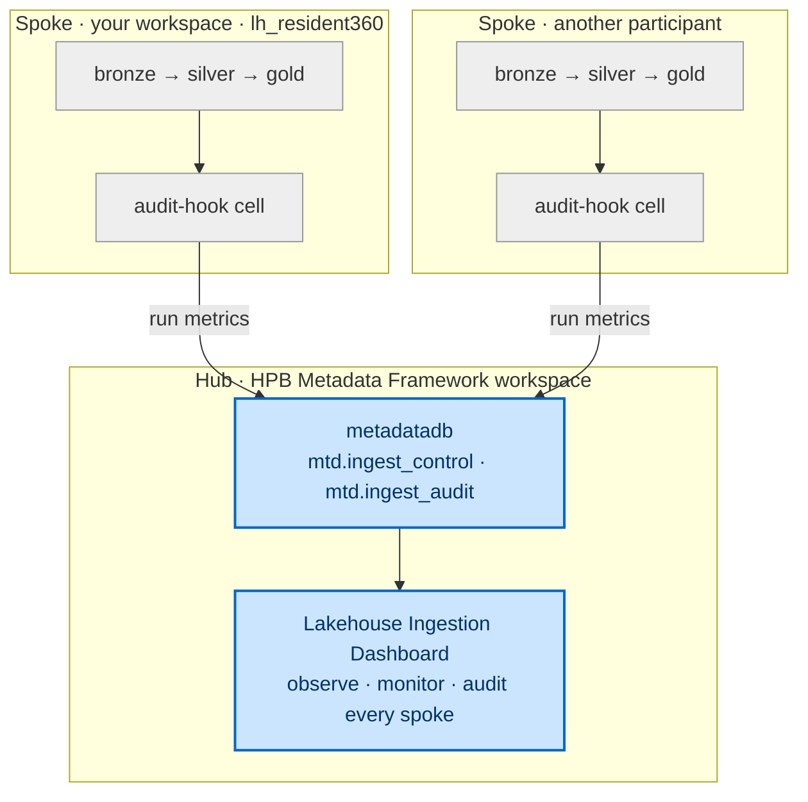
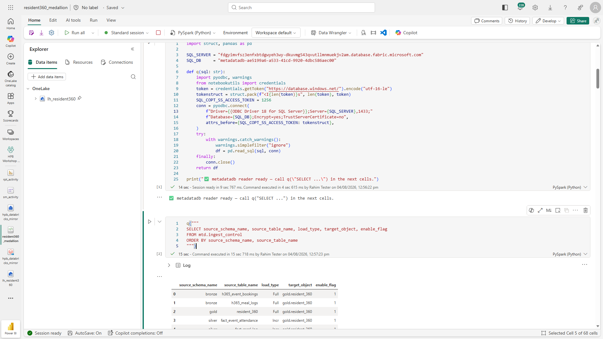
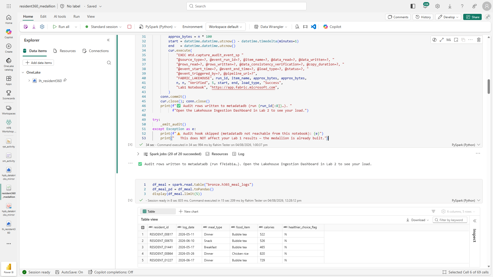
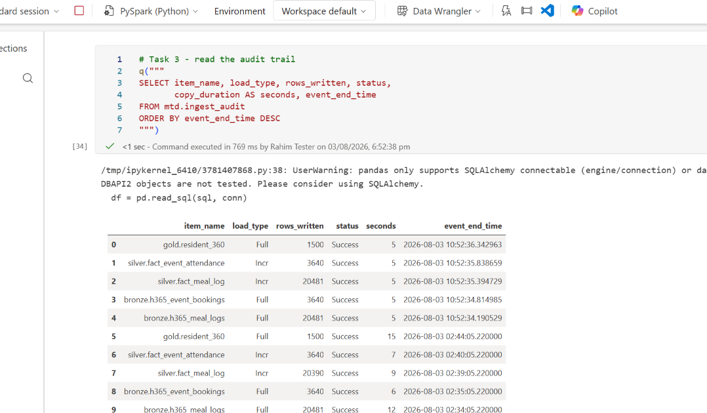
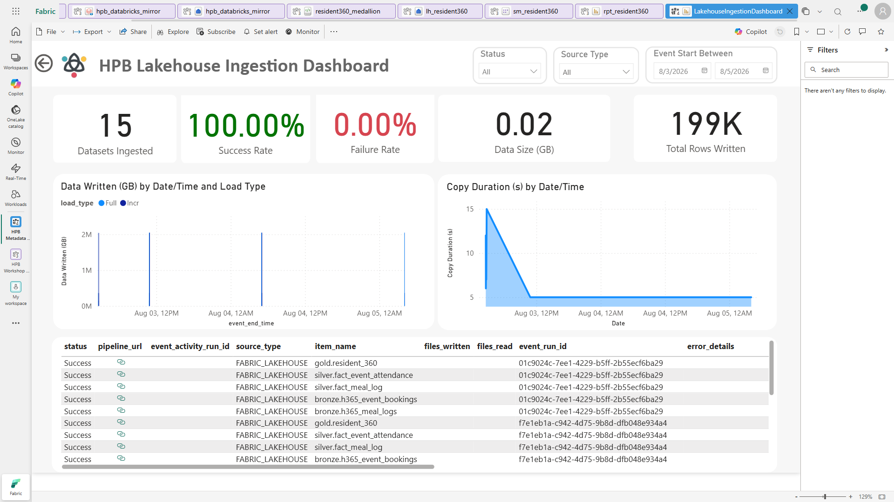
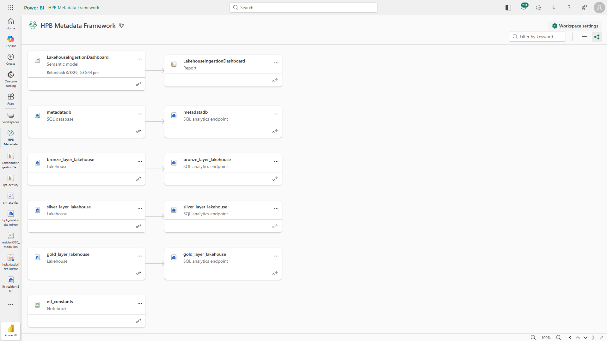

[← Workshop home](../README.md)

# Lab 2 · Govern & Trace

## Metadata-driven lakehouse — observability & traceability

**⏱ 60 min**  ·  **🎯 Focus:** #6 Data quality & traceability

### The story

In Lab 1 you built the Resident 360 medallion by hand. In production, HPB runs **hundreds** of such
loads across **many workspaces** — and needs to answer, at a glance: *did every load succeed? how many rows moved?
how long did it take? is the data consistent?* That's what a **metadata-driven lakehouse** gives you, arranged as a
**hub-and-spoke**: a central **hub** workspace (`HPB Metadata Framework`) holds the **control + audit database**
(`metadatadb`) and a **dashboard**; every **spoke** workspace (yours, and every other participant's) reports each load
into the hub. The hub **observes, monitors and audits** all the spokes from one place.

You won't build the framework from scratch (that's a facilitator preflight — see
`assets/PROVISIONING-RUNBOOK.md`). Instead you'll **connect your Lab 1 medallion (a spoke) to the hub** and watch your
own transform runs surface in the central governance dashboard alongside everyone else's.

### You'll do

- Read the hub's **control** table from your Lab 1 notebook to see how loads are config-driven.
- Add **one audit-hook cell** to your Lab 1 notebook so each run reports its metrics into the hub's `metadatadb`.
- Read the **audit** trail to see your own load on the record.
- Open the **Lakehouse Ingestion Dashboard** in the hub and read the observability + traceability story — your load
  appears next to the other spokes.

> **Why from the notebook?** The hub workspace is shared with you **read-only**, so its `metadatadb`
> query editor is disabled for participants. Instead you'll read `metadatadb` straight from **your own**
> Lab 1 notebook using a tiny helper — it runs with **your** identity, which has read access to the tables.
> This is also closer to how a real pipeline (a spoke) talks to the central control store.

### Where this fits — hub-and-spoke



**Builds on:** the medallion from Lab 1. Your workspace is one **spoke**; the central **hub** sees them all (you see
your own rows filtered to your load).

### Files

- `assets/metadatadb-read-cell.py` — a small helper cell that lets you read `metadatadb` from your notebook
  (defines `q("SELECT ...")`). You paste this in **Task 1**.
- `assets/audit-hook-cell.py` — the cell you paste at the end of your Lab 1 notebook to report your load
  into `metadatadb`. You paste this in **Task 2**.
- `assets/PROVISIONING-RUNBOOK.md` — *facilitator only*: how the framework was deployed (`metadatadb`,
  lakehouses, pipelines, dashboard). Read this only if you're setting the framework up.

> **Facilitator preflight (before the room starts):** deploy/verify the framework, share the
> `HPB Metadata Framework` workspace as **Viewer** with participants, grant them `SELECT` + `EXECUTE` on the
> `mtd` schema, and fill `SQL_SERVER` / `SQL_DB` into both asset cells. Full steps and the live values are in
> `assets/PROVISIONING-RUNBOOK.md` and the private facilitator record.

> **New to Fabric?** Each step is small and self-contained — follow them in order.

---

### Task 1 — See the framework's brain: the control table

The framework is driven by a config table — no hard-coded pipelines. You'll read it from **your own**
Lab 1 notebook.

1. Go to **your** workspace and open your **Lab 1 medallion notebook** (`resident360_medallion`).
2. **Add a new cell** (anywhere after the first setup cell). Open `assets/metadatadb-read-cell.py`, copy its
   full contents, and paste them in.
3. Check the two values at the top — `SQL_SERVER` and `SQL_DB` — match the facilitator's `metadatadb`
   (they're usually pre-filled on the kit you were handed; if not, the facilitator will give you the two values).
4. **Run that cell.** You should see `✅ metadatadb reader ready`.
5. **Add another new cell** and run this read:

   ```python
   q("""
   SELECT source_schema_name, source_table_name, load_type, target_object, enable_flag
   FROM mtd.ingest_control
   ORDER BY source_schema_name, source_table_name
   """)
   ```

6. Notice the rows describe **your** medallion tables — `bronze.h365_*`, `silver.fact_*`, `gold.resident_360` —
   each with its **load type** (Full / Incr) and **target**. This config *is* the framework: add a row, and
   a new table is governed. No code change.



> **Done when you see:** five control rows naming your bronze / silver / gold tables.

---

### Task 2 — Connect your Lab 1 notebook to the audit store

Now make your transform **report** each run into the framework.

1. Go back to **your** workspace and open your **Lab 1 medallion notebook** (`resident360_medallion`).
2. **Add a new cell at the very end.**
3. Open `assets/audit-hook-cell.py`, copy its full contents, and paste them into that cell.
4. Confirm the `SQL_SERVER` and `SQL_DB` values at the top match the facilitator's `metadatadb`
   — these are the **same two values** you used for the reader cell in Task 1.
5. **Run only that cell.**

   

> **Done when you see:** `✅ Audit rows written to metadatadb …`. (If you see a ⚠️ skip message, tell the
> facilitator — your Lab 1 results are unaffected either way.)

---

### Task 3 — Read the audit trail

1. Back in your notebook, **add a new cell** and run this read (uses the same `q()` helper from Task 1):

   ```python
   q("""
   SELECT item_name, load_type, rows_written, status,
          copy_duration AS seconds, event_end_time
   FROM mtd.ingest_audit
   ORDER BY event_end_time DESC
   """)
   ```

2. Each row is one **traceable** load event: which table, how many rows, success/failure, how long, and when.
3. Find the row for **`gold.resident_360`** — that's your unified view's load, now on the record.



> **Done when you see:** an audit row for `gold.resident_360` with your row count and `Success`.

---

### Task 4 — Open the hub's observability dashboard

1. In the central **`HPB Metadata Framework`** hub workspace, open the **Lakehouse Ingestion Dashboard**.
2. Read the tiles: **rows / data ingested by layer**, **success vs. failure**, **load duration**, **runs over time** — the hub aggregates every spoke's loads here.
3. Filter to **`gold.resident_360`** (or your run) — the dashboard now tells the operational story of the
   medallion **you** built (your spoke): what moved, whether it was consistent, and how long it took.



> **Done when you see:** your `gold.resident_360` load reflected in the dashboard tiles.

---

### Task 5 — Trace it end-to-end

1. In the workspace, switch to **Lineage view** (top-right toggle, next to the search box).
2. Follow the chain: **dashboard → semantic model → `metadatadb`** and, in your own workspace,
   **`gold.resident_360` → silver → bronze → the mirrored Databricks tables**.
3. This is **traceability**: from a governance tile back to the raw source, and — via the audit table —
   *when* each hop last ran and whether it succeeded.



> **Done when you see:** the lineage graph linking the dashboard to `metadatadb`, and your medallion back to the mirror.

---

### ✅ Checkpoint

- [ ] Found your tables in `mtd.ingest_control`
- [ ] Added the audit-hook cell and got `✅ Audit rows written`
- [ ] Read your load in `mtd.ingest_audit`
- [ ] Saw your `gold.resident_360` load in the Ingestion Dashboard
- [ ] Traced lineage from the dashboard back to your medallion

---

### Next up

**[Lab 3 · Nudges That Land →](../lab3-datascience-ml/README.md)**
