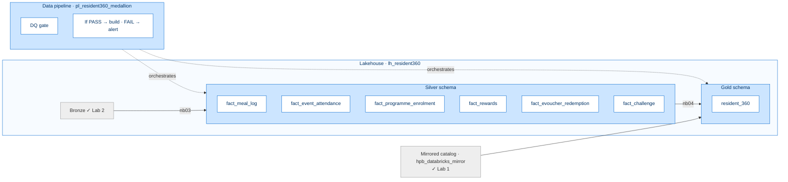
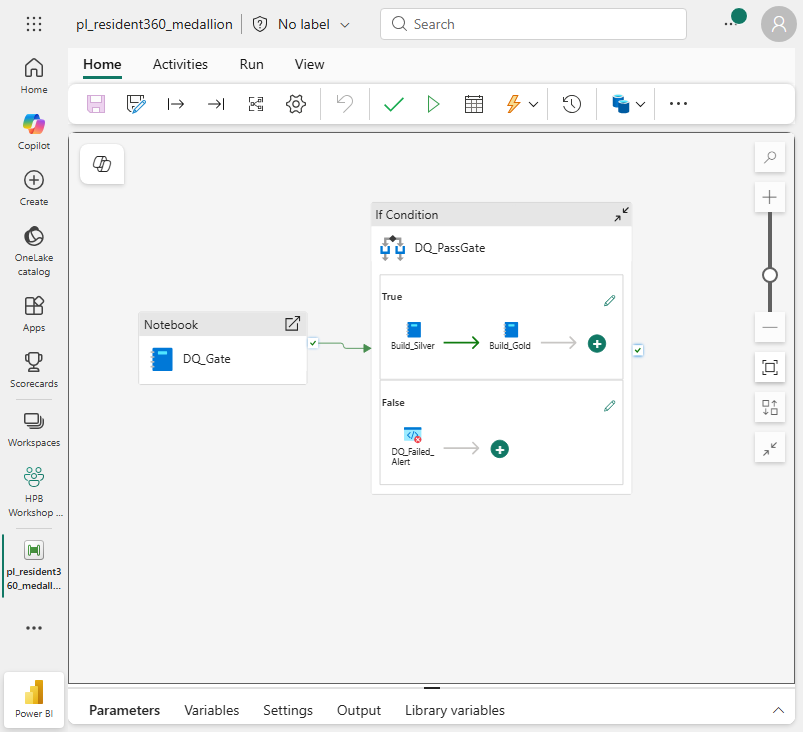

[← Workshop home](../README.md)

# Lab 3 · Fresh Every Morning
## Transform, build Gold & orchestrate

**⏱ 50 min**  ·  **🎯 Focus:** #2 Orchestration + conditional triage · #5 DE features

### The story
Rahim's 360 profile rebuilds **automatically every morning**, and a quality gate stops bad data from ever
reaching him. Today's nudge reflects yesterday, and the numbers are right.

### You'll build
- **Silver** fact tables (clean, conform, upsert, CDC, schema evolution, time travel).
- The **`gold.resident_360`** table — one row per resident across every domain.
- A **pipeline** with a data-quality gate that triages build vs alert, on a daily schedule.

### Where this fits



**Builds on:** Lab 2's Bronze + Lab 1's mirror. Produces the unified Gold that Labs 5–6 consume.

### Files
- `notebooks/03_build_silver.ipynb` — clean/conform six silver facts
- `notebooks/04_build_gold_resident360.ipynb` — harmonise all domains into `gold.resident_360`
- `notebooks/05_dq_gate.ipynb` — PASS/FAIL gate for the pipeline

> **Import all three notebooks first** (**Import → Notebook → From this computer**), and attach
> **`lh_resident360`** to each (**Explorer → Add data items → From OneLake catalog**). The pipeline needs each
> notebook to have a saved default Lakehouse.

---

### Task 1 — Build Silver
1. Open **`03_build_silver`**, confirm `lh_resident360` is attached, **Run all**.
2. Watch the DE features as they run:
   - **Schema evolution** — appends a new `logged_via` column with `mergeSchema`.
   - **CDC** — enables Change Data Feed on the events fact.
   - **Time travel** — `DESCRIBE HISTORY` prints table versions.
3. **Result:** six silver tables:
   - `fact_meal_log`
   - `fact_event_attendance`
   - `fact_programme_enrolment`
   - `fact_rewards`
   - `fact_evoucher_redemption`
   - `fact_challenge`

> **Done when you see:** six tables under the `silver` schema and the `DESCRIBE HISTORY` output printing versions.

> **Note:** The notebook overwrites with `overwriteSchema=true`, so it's safe to re-run (the pipeline re-runs it daily).

### Task 2 — Build the Gold Resident 360
1. Open **`04_build_gold_resident360`**, confirm the Lakehouse is attached.
2. Check the top cell sets `DBX = "hpb_databricks_mirror.gold"` (matches your Lab 1 mirror name).
3. **Run all** → creates **`gold.resident_360`** (1,500 rows), one row per resident, joining:
   - **activity + screening** from the mirror
   - **diet, events, programmes, rewards, eVouchers, challenges** from silver
   - a regional **air-quality** view (`region_psi`, `region_is_hazy`) from Lab 2's API table
   - the `is_disengaged` label used by Lab 5
4. **View data:** Lakehouse → **Tables → gold → resident_360 → View data**.

> **Note:** The `gold` schema must be writable. If a read-only `gold` mirror shortcut exists in
> `lh_resident360`, the write fails with 403. Delete any `gold` shortcut before running.

### Task 3 — Orchestrate with conditional triage
Build a pipeline: run the **DQ gate**, then an **If Condition** that builds silver→gold on PASS or alerts on FAIL.

1. Select **+ New item → Data pipeline** → name **`pl_resident360_medallion`**.
2. Select **Activities → Notebook** → name **`DQ_Gate`** → **Settings → Notebook** → open the dropdown and **click the
   exact notebook name `05_dq_gate`**, then confirm the field shows it before moving on (if it's left blank or
   wrong, the run later errors with *"Notebook id is required."*).

3. Select **Activities → If conditions** → name **`DQ_PassGate`**. Drag `DQ_Gate`'s green ✓ handle onto it.
4. Select `DQ_PassGate` → **Activities → Expression** → paste:
   ```
   @equals(json(activity('DQ_Gate').output.result.exitValue).status,'PASS')
   ```

> **Note:** Three things must be right — reference the activity name `DQ_Gate` (not the file name); the
> exit value is at `output.result.exitValue`; wrap it in `json(...)`. Run the gate once and open its **Output**
> to confirm the path.

5. **True branch** (pencil on Case = True): add Notebook **`Build_Silver`** (`03_build_silver`) → Notebook
   **`Build_Gold`** (`04_build_gold_resident360`); connect Silver's ✓ → Gold.
6. **False branch** (Case = False): add a **Fail** activity **`DQ_Failed_Alert`** with a clear message.
7. Select **Home → Validate** (want "No errors found") → **Save → Run**. Watch
   **DQ_Gate → DQ_PassGate → Build_Silver → Build_Gold** succeed.
8. Select **Home → Schedule → Add schedule** → **Daily**, **06:00**, your **Time zone** → **Save**.



---

> **Fell behind?** Materialize the fallback into your writable `gold` schema and keep going:
> ```python
> spark.sql("CREATE SCHEMA IF NOT EXISTS gold")
> (spark.table("hpb_databricks_mirror.gold.resident_360_prebuilt")
>       .write.mode("overwrite").saveAsTable("gold.resident_360"))
> ```
> Don't shortcut the prebuilt table into `gold` — a mirror shortcut is read-only and collides (403).

### ✅ Checkpoint
- [ ] Six silver facts built (upsert + schema evolution + CDC + time travel)
- [ ] `gold.resident_360` created (1,500 rows)
- [ ] Pipeline branches on the DQ gate (PASS → build; FAIL → alert) and is scheduled

### 🟡 Challenge (optional) — SCD Type 2 on `dim_resident`
1. Add `valid_from`, `valid_to`, and `is_current` columns to a working copy of `dim_resident`.
2. On a changed attribute, `MERGE` to close the current row (`valid_to = now`, `is_current = false`) and insert a new current row.
3. Query one resident's history and confirm multiple versions with exactly one `is_current = true`.

**Other ideas:** rebuild Silver incrementally from the **Change Data Feed**; or add a **Switch** activity routing by source with a `_rejects` quarantine.

---

### Next up
**[Lab 4 · Never Drops a Step](../lab4-monitor-debug/README.md)**

