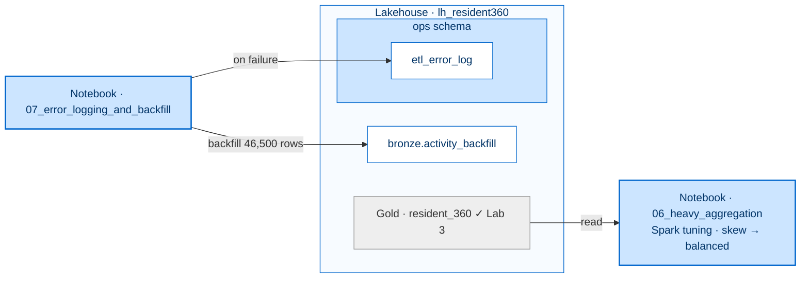

[← Workshop home](../README.md)

# Lab 4 · Never Drops a Step
## Monitor, prioritise & debug

**⏱ 45 min**  ·  **🎯 Focus:** #3 Spark monitoring · #4 Resource prioritisation · #6 Debugging

### The story
When a data outage hits, the platform **backfills** it so Rahim's streak and history stay intact — and tuning
plus the right resource priorities keep the app fast for millions.

### You'll build
- A tuned Spark job (skew → balanced), read in the **Spark UI** and the **Spark Monitoring dashboard**.
- An understanding of **resource prioritisation** when ETL and ad-hoc jobs compete.
- Error logging to `ops.etl_error_log` and a **parameterised, idempotent backfill** of the May-2026 gap.

### Where this fits

**Builds on:** Lab 3's pipeline. Hardens it — no new data layer, just reliability at scale.

### Files
- `notebooks/06_heavy_aggregation.ipynb` — skewed vs tuned job + resource prioritisation
- `notebooks/07_error_logging_and_backfill.ipynb` — error logging + backfill

> Import both notebooks (**Import → Notebook → From this computer**) and attach **`lh_resident360`**.

---

### Task 1 — Spark UI & tuning
1. Open **`06_heavy_aggregation`**, attach the Lakehouse.
2. **Run cell 1 — the skewed job** (`repartition(1)`). Expect `rows: 1500`.
3. Open the **Spark UI** (cell progress bar → **Open Spark UI**) → **Stages** → note one task dominates
   Duration and Shuffle Read — that's the skew.
4. **Run cell 2 — the tuned job** (AQE + `repartition(8, "resident_id")`). Expect `rows: 1500`.
5. Re-open the Spark UI → tasks are now balanced and the stage is faster. Same answer, better parallelism.

### Task 2 — Resource prioritisation (ETL vs ad-hoc)
1. Read the cell 3 notes: on Fabric, **capacity (CU)** replaces cluster sizing, so a heavy ad-hoc job can starve
   the nightly ETL.
2. Understand the three levers:
   - **Custom (On-Demand) Spark pool + Environment** — give the nightly ETL its own pool.
   - **Autoscale Billing for Spark** — move bursty ad-hoc Spark to dedicated serverless billed separately.
   - **High-concurrency session sharing** — many light notebooks share one session.
3. **See it live:** open the facilitator's **Spark Monitoring** KQL dashboard (fabric-toolbox accelerator) to
   compare this job's memory / CPU / shuffle / spill and read its **SparkLens** recommendation on whether more
   resources would actually help.

> **Try it (optional, in pairs):** re-run cell 1 while a neighbour runs a job on the same capacity, then watch
> both applications contend in **Monitor hub → Spark applications**.

### Task 3 — Error logging & backfill
1. Open **`07_error_logging_and_backfill`**, attach the Lakehouse.
2. Read the **`run_step()`** wrapper — any wrapped failure is appended to **`ops.etl_error_log`** and re-raised.
3. The first code cell is the **Parameters** cell (`start_date`, `end_date`) — a pipeline can override these.
4. **Run all** with defaults → generates 31 days × 1,500 residents and MERGEs them into
   **`bronze.activity_backfill`**. Expect `Backfilled 46500 activity rows …`.
5. **Re-run** — the MERGE keeps it at 46,500 rows, proving the backfill is idempotent (safe for retries).

> **Note:** The mirror is read-only, so recovered rows land in `bronze.activity_backfill`, not the mirror.

> **Note:** The error log is created lazily. A clean run creates the empty **`ops`** schema but **not** the
> `ops.etl_error_log` table — that table only materialises the first time a wrapped step actually fails. To see it
> populated, force a demo error (e.g. point `start_date` at a malformed value) inside a `run_step()` call, then
> query `ops.etl_error_log`.

### Task 4 — Notifications & repair (discuss)
- The Lab 3 pipeline's False branch (`DQ_Failed_Alert`) is your failure path — swap in a **Teams/Outlook**
  activity if you have a connection.
- In **Monitor hub**, open a failed run → **Rerun → Rerun from failed activity** — successful steps aren't
  repeated.

---

### ✅ Checkpoint
- [ ] Skew vs balanced tasks compared in the Spark UI
- [ ] Resource-prioritisation levers understood; job viewed in the Spark Monitoring dashboard
- [ ] `ops` schema created; backfill filled the May-2026 gap idempotently (46,500 rows). *(The
  `ops.etl_error_log` table appears only after a step actually fails — see the Task 3 note.)*

### 🟡 Challenge (optional) — kill the skew
1. Enable AQE skew-join (`spark.sql.adaptive.enabled=true`, `spark.sql.adaptive.skewJoin.enabled=true`) and **broadcast** the small dimension.
2. Salt the hot key: add a random suffix on the skewed side and replicate the key on the dimension side, then join and drop the salt.
3. Re-run and compare the longest-stage time in the **Spark UI** before vs after.

**Other ideas:** wire a **Data Activator** alert on the reject count; or drive a multi-window backfill from a **ForEach** with a bounded batch count.

---

### Next up
**[Lab 5 · Nudges That Land](../lab5-datascience-automl/README.md)**

