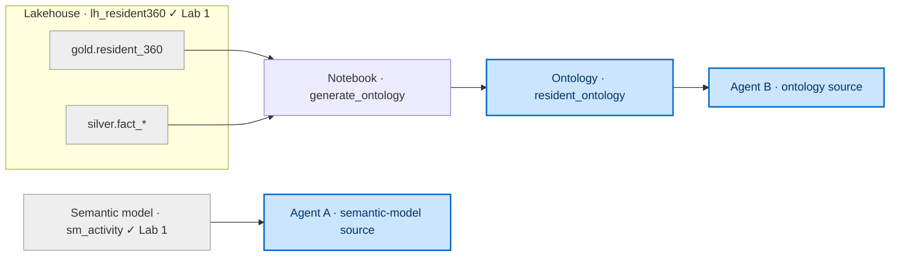
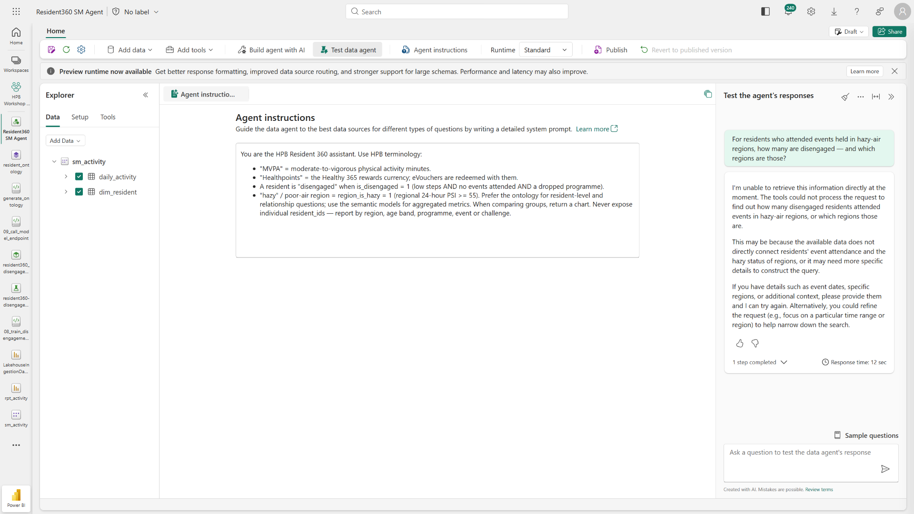
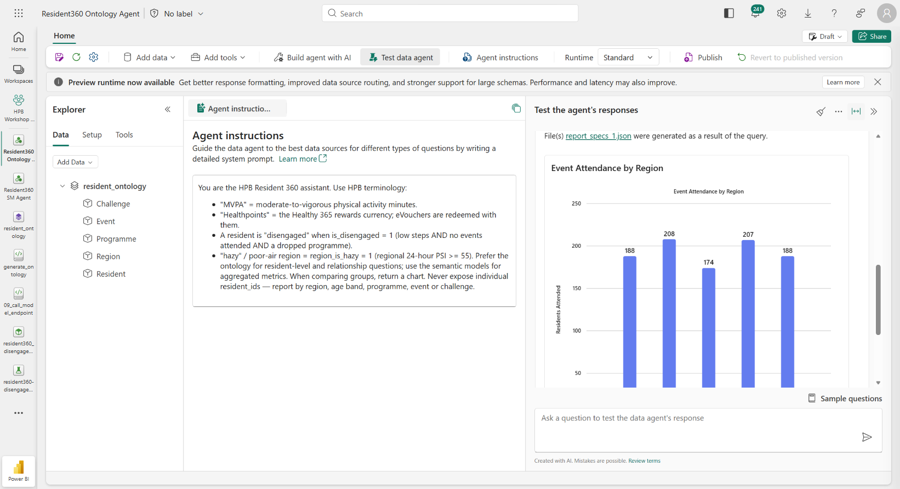

[← Workshop home](../README.md)

# Lab 4 · Just Ask
## Ontology + data agent — semantic model vs. ontology

**⏱ 45 min**  ·  **🎯 Focus:** #1 Data lineage (capstone)

### The story
HPB programme designers want to ask plain-English questions across Rahim's unified view — and get answers that join
domains a flat model can't. You'll **generate an ontology from your data** (a notebook does the modelling), wire a
**data agent** to it, and prove it beats a semantic-model-only agent on relationship-aware questions.

### You'll build
- An **ontology** (`resident_ontology`) — its blueprint **generated from your `gold`/`silver` data** by a notebook.
  Two entities (**Resident**, **Region**) get a **second, timeseries binding** — the ontology reads two tables as one entity.
- A **semantic-model** data agent (baseline) and an **ontology** data agent.
- A side-by-side **comparison** on a multi-hop question, plus **end-to-end lineage**.

### Where this fits

**Builds on:** the medallion + `sm_activity` from Lab 1. This is the governed, conversational capstone.

### Files
- `notebooks/generate_ontology.ipynb` — reads your data and prints the ontology **blueprint**.
- `assets/data_agent_questions.md` — the agent instructions + question bank.

> **New to Fabric?** Each step is small and self-contained — follow them in order.

---

### Task 1 — Generate the ontology blueprint from your data

1. Import **`generate_ontology.ipynb`** (workspace **Import → Notebook → From this computer**) and open it.
2. Attach the **`lh_resident360`** Lakehouse (Explorer → **Add data items → From OneLake catalog** → the Lakehouse).
3. Click **Run all**.
4. Read Section 1's output — the **entities** it found (Resident, Region, Event, Programme, Challenge) with their keys and instance counts. Note that **Resident** and **Region** each list **two binding rows** — a static profile (Timestamp = None) **plus a timeseries fact** (Resident ← `silver.fact_meal_log`@`log_date`; Region ← `silver.fact_event_attendance`@`event_date`).
5. Read Section 2's output — the **relationships** it found (e.g. Resident —livesIn→ Region), with the exact key columns.
6. Scroll to Section 3 — the **blueprint** (two tables: entities and relationships). **Keep this on screen** for Task 2.

> **Done when you see:** a printed blueprint listing the entities and the relationships with their mapping tables and `origin → target` keys — with **Resident** and **Region** each showing a **second, timeseries** binding row (a date column in the Timestamp position).

---

### Task 2 — Create the ontology and apply the blueprint

You're not designing anything — simply applying the spec the notebook generated.

1. Workspace → **+ New item** → search **Ontology** → click **Ontology (preview)** → name it **`resident_ontology`** → **Create**.
2. If a welcome dialog appears, check **Don't show again** and close it.
3. **Add the entities.** For each row in the blueprint's *entities* table:
   1. Ribbon → **Add entity type** → name it (e.g. **Resident**).
   2. **Configure entity type → Add properties from data → Add data binding → Lakehouse table** → select the blueprint's **binding** table.
   3. Set the **key** to the blueprint's key column.
   4. In **Timeseries data**, set **Timestamp = None**.
   5. **Save**.
   6. **Two-binding entities (Resident, Region).** The blueprint lists a **second, timeseries** binding for these. After the first (static) binding saves, stay on that entity → **Manage property bindings → Add binding and properties** → **Add data binding → Lakehouse table** → select the second table (Resident ← `silver.fact_meal_log`; Region ← `silver.fact_event_attendance`) → the key auto-maps → in **Timeseries data** select the **date column** as **Timestamp** (Resident → `log_date`; Region → `event_date`) → **Save**. The entity now reads a static profile **and** a timeseries.

   > ⚠️ **One non-timeseries binding only.** The first binding is non-timeseries (**Timestamp = None**). Every **additional** binding **must be timeseries** — the editor requires you to select a date column and disables **None** ("Only one non-timeseries binding is allowed per entity type"). A second static table (no date column) is rejected with *"The selected data source has no date/time columns."*
   > ⚠️ Bind **Lakehouse tables only** (the picker also offers Eventhouse).
   > ⚠️ **Duplicate columns:** if the second table repeats a column already bound (e.g. `resident_id`), the editor flags *"…already bound in another binding"* — click **Delete property binding** on that row in the second binding before Save.

4. **Add the relationships.** For each row in the blueprint's *relationships* table:
   1. Ribbon → **Add relationship** → set **name**, **origin**, **target** → **Create**.
   2. Click the new **edge** on the canvas → **Browse available sources** → select the blueprint's **mapping table**.
   3. Map the **origin key** and the **target key** exactly as the blueprint shows.
   4. **Verify both `Matched <Entity>` dropdowns** show the intended columns, then **Save**.

> **Done when you see:** the entity nodes joined by the named edges on the canvas (the editor auto-saves — no publish).

> **Editor tips (preview):** bind **Lakehouse tables only**; on the **first (static)** binding set **Timestamp = None** — and set it **last**, right before Save, because selecting the entity key can reset the Timestamp field back to empty. Each entity: *Configure entity type → Add properties from data → Add data binding → Lakehouse table → select table → Define entity type key → Timestamp = None → Save.* For a **second (timeseries) binding** (Resident, Region): *Manage property bindings → Add binding and properties → Add data binding → Lakehouse table → select the fact table → select the **date column** as Timestamp → delete any duplicated column → Save.* Each relationship: *Add relationship → name/origin/target → Create → View Relationship Type details → Browse available sources → select the mapping table → map both keys → Save.*

---

### Task 3 — Build the baseline agent (semantic-model source)

1. Workspace → **+ New item → Data agent** → name **`Resident360 SM Agent`** → **Create**.
2. Toolbar → **Add data → Data source** → select **`sm_activity`** → **Add**.
3. In the Explorer, check **`daily_activity`** and **`dim_resident`**.
4. Toolbar → **Agent instructions** → paste the instructions from `assets/data_agent_questions.md`.
   *(The instructions box is a **Markdown preview** — click it once to switch to edit mode, then paste.)*

---

### Task 4 — Build the ontology agent

1. Workspace → **+ New item → Data agent** → name **`Resident360 Ontology Agent`** → **Create**.
2. Toolbar → **Add data → Data source** → select **`resident_ontology`** → **Add** (added whole — no tables to check).
3. Toolbar → **Agent instructions** → paste the same instructions from `assets/data_agent_questions.md`.

---

### Task 5 — Prove the ontology wins

1. Ask **both** agents the same multi-hop question:

   > *"For residents who attended events held in hazy-air regions, how many are disengaged — and which regions are those?"*

2. Read the **SM agent's** answer: it only has activity data, so it can't join events + air quality — it declines or answers narrowly.

3. Read the **Ontology agent's** answer: it traverses **Resident → attended → Event → heldIn → Region (`region_is_hazy`)** and answers cleanly, grouped by region.

4. Try 2–3 more questions from the bank and **generate a visual** for each.

> **Note:** a multi-hop ontology answer takes ~60–90 sec (plan → query the graph → chart). It reports by group, never by individual `resident_id`.

> ⚠️ **Facilitator note — select a Q1 that returns data.** The `is_disengaged` flag is defined as *low steps **AND no events attended** AND a dropped programme*, so "**disengaged** residents who **attended** events" is an empty set — an agent will correctly answer *"no data."* For the headline win to land, ask the multi-hop **without** the disengaged filter, e.g. *"For residents who attended events in hazy-air regions, how many attended per region — and which regions are hazy?"* (still traverses Resident → attended → Event → heldIn → Region). The **contrast still holds**: the SM agent can't answer either phrasing (no event/haze data); the ontology agent can.

---

### Task 6 — End-to-end lineage

1. In the workspace, switch to **Lineage view**.
2. Trace one artifact back through the graph — from an agent/report to the semantic model, to `gold.resident_360`, to `silver`/`bronze`, to the mirrored Databricks tables. *(Read the actual graph on screen — it's your authoritative lineage.)*

   

3. Right-click a mirrored table → **Impact analysis** ("if this changes, what breaks?").
4. **Endorse** a semantic model: **⋯ (More options) → Settings → Endorsement and discovery → Promoted → Apply**.

---

### ✅ Checkpoint
- [ ] Ran the generator notebook → got the blueprint
- [ ] `resident_ontology` built from the blueprint (entities + relationships)
- [ ] Two agents built (semantic-model and ontology)
- [ ] Ontology agent answers a multi-hop question the SM agent can't
- [ ] Lineage traced; a model endorsed

---

### Next up
**Wrap-up & next steps**
