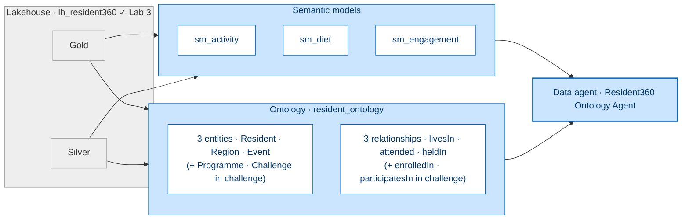
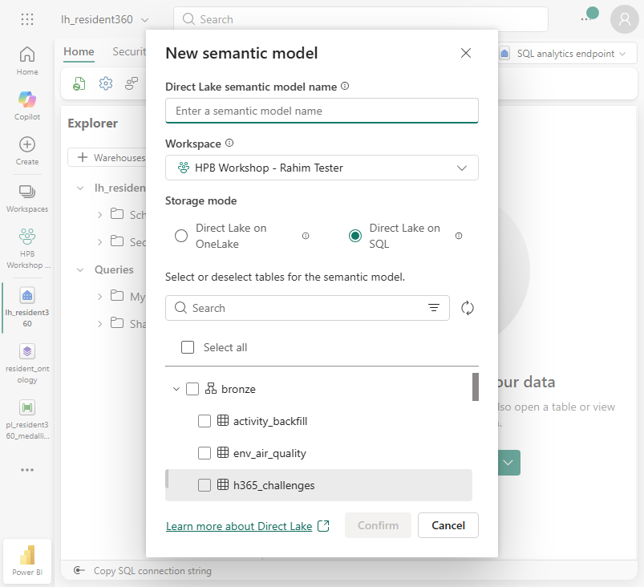
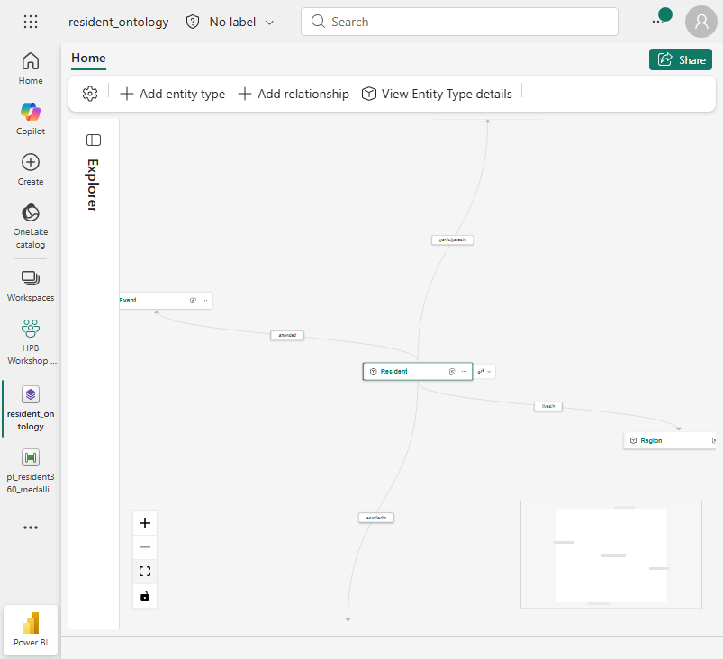
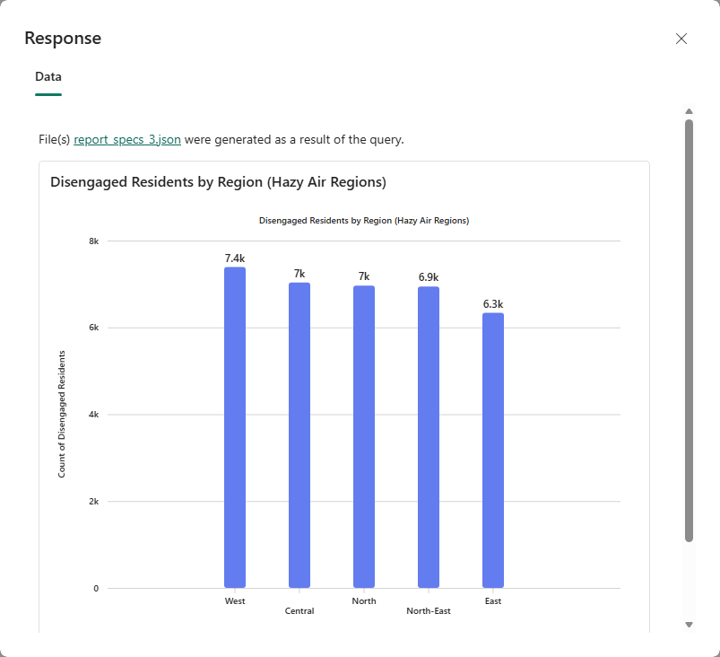

[← Workshop home](../README.md)

# Lab 6 · Just Ask
## Ontology + data agent + end-to-end lineage (capstone)

**⏱ 45 min**  ·  **🎯 Focus:** #1 Data lineage (capstone)

### The story
HPB programme designers want to ask plain-English questions across Rahim's unified view — and trust every
answer back to source. We build a focused **3-entity ontology** (Resident · Region · Event), wire it to a
**data agent**, and prove it answers relationship-aware questions the Lab 1 agent can't — then extend it to the
**full 5-entity graph** in the challenge.

### You'll build
- Three **Direct Lake semantic models** (Activity / Diet / Engagement).
- A **Fabric IQ ontology** with **3 entities + 3 relationships** (extend to **5 + 5** in the challenge).
- A **data agent** over the ontology + semantic models.
- **End-to-end lineage** from Databricks to the agent.

### Where this fits

**Builds on:** everything so far. Adds the governed, conversational layer — the capstone over the full stack.

### Files
- `assets/semantic_models_plan.md` — the three models and their tables
- `assets/ontology_plan.md` — entities, bindings, relationships
- `assets/data_agent_questions.md` — question bank + agent instructions

---

### Task 1 — Build three semantic models (Direct Lake)
Open `lh_resident360`, switch to the **SQL analytics endpoint** (top-right mode switcher) → **New semantic
model**, and build each from its tables (relate on `resident_id`, add 1–2 measures, rename, Save). Reuse
**`sm_activity`** from Lab 1.

> **Note:** Build the models from the **SQL analytics endpoint's** New semantic model, not the
> Lakehouse Home-ribbon button — on a schema-enabled lakehouse the Home-ribbon dialog lists no tables. The
> endpoint dialog shows the `bronze` / `silver` / `gold` schema folders. Creating a model may open a stray
> sign-in tab; close it and return to the workspace.

| Model | Tables |
|-------|--------|
| `sm_activity` *(reuse)* | mirror `dim_resident` + `daily_activity` |
| `sm_diet` | `silver.fact_meal_log` + `gold.resident_360` |
| `sm_engagement` | `fact_event_attendance` + `fact_programme_enrolment` + `fact_rewards` + `fact_challenge` + `fact_evoucher_redemption` |

### Task 2 — Build the ontology (3 entities + 3 relationships)
1. Select **+ New item → Ontology (preview)** → name **`resident_ontology`** → on the welcome dialog tick **Don't show
   again** and close it (it otherwise reappears each time you open the editor).
2. Add the three entity types and bind each (**Configure entity type → Add properties from data → Add data
   binding → Lakehouse table**). See `assets/ontology_plan.md` for the exact click-path.

| Entity | Key | Binding | Timestamp |
|--------|-----|---------|-----------|
| **Resident** | `resident_id` | `gold.resident_360` | **None** |
| **Region** | `region` | `gold.resident_360` | **None** |
| **Event** | `event_id` | `silver.fact_event_attendance` | **None** |

> **Region carries air quality.** `gold.resident_360` includes `region_psi` and `region_is_hazy` (added in Lab 3),
> so the **Region** entity — and any event linked to it via `heldIn` — knows whether its air is hazy.

3. Add three relationships. For **each** one: on the ribbon select **Add relationship** (name + origin + target → Create),
   then **click the relationship edge → Browse available sources → pick the mapping table below → map each
   entity's key column → Save**.

   | Relationship | Mapping table | Origin key → Target key |
   |---|---|---|
   | Resident —**livesIn**→ Region | `gold.resident_360` | `resident_id` → `region` |
   | Resident —**attended**→ Event | `silver.fact_event_attendance` | `resident_id` → `event_id` |
   | Event —**heldIn**→ Region | `silver.fact_event_attendance` | `event_id` → `region` |

> **Bind Lakehouse tables only** (the picker also offers Eventhouse) — this is the one gotcha that stops the build.
>
> **Note:**
> - **All three entities** bind to a table that carries a date/time column (`gold.resident_360` has `join_date`,
>   `fact_event_attendance` has an event date), so each shows a required **Timestamp column** in the *Timeseries data*
>   section — set it to **None** for all three (a timestamp on a single, non-timeseries binding triggers a
>   "non-timeseries binding required" error and blocks Save).
> - A relationship isn't done at "Create" — open its edge and finish the **mapping table + key columns**, or it won't traverse. The editor auto-saves (no publish).
> - After you pick the **mapping table**, one key column auto-binds but the other shows **Select a column** — set it
>   explicitly, and **verify BOTH `Matched <Entity>: <key>` dropdowns** show the intended source column before **Save**
>   (`livesIn`: `resident_id` + `region`; `attended`: `resident_id` + `event_id`; `heldIn`: `event_id` + `region`).
> - **Done when you see:** three entity nodes on the canvas joined by the three named edges (`livesIn`, `attended`, `heldIn`).

### Task 3 — Connect the data agent
1. Select **+ New item → Data agent** → name **`Resident360 Ontology Agent`**.
2. Select **Add data → Data source** → add **`resident_ontology`** + **`sm_activity`** + **`sm_diet`** +
   **`sm_engagement`**.
3. On the **Setup** tab → **Agent instructions**, paste the instructions from `assets/data_agent_questions.md`.

> **Note:** The **Add data** picker adds **one source at a time** — repeat *Add data → Data source*
> for each of the four. For each **semantic model**, tick its **tables** in the schema browser (the agent
> won't answer until at least one table per model is selected); the **ontology** is added whole (no tables to
> tick).

### Task 4 — Prove the ontology wins
Ask the **same** question to the **Lab 1 agent** (`Resident360 Agent` — flat, activity-only) and this **ontology
agent**:

> *"For residents who attended events held in hazy-air regions, how many are disengaged — and which regions are those?"*

The Lab 1 agent only has activity data (no events, no air quality), so it can't join those domains. The ontology
agent traverses **Resident → attended → Event → heldIn → Region (`region_is_hazy`)** and answers cleanly, grouped
by region. Try 2–3 more from the question bank and **generate a visual** for each.

> **Note:** A multi-hop ontology answer takes ~60–90 sec (the agent plans, queries the graph, then charts the
> result) — this is expected. The agent reports by group (region, event, programme), never individual
> `resident_id`s. **Done when you see:** a grouped answer plus an auto-generated chart.

### Task 5 — End-to-end lineage
1. In the workspace, switch to **Lineage view**.
2. Trace a report KPI back: **report → semantic model → `gold.resident_360` → silver → bronze → mirrored
   Databricks tables**.
3. Right-click a mirrored table → **Impact analysis** ("if this changes, what breaks?").
4. **Endorse / Promote** one of your semantic models (e.g. **`sm_engagement`**): **… (More options) →
   Settings → Endorsement and discovery → Promoted → Apply**.

---

### ✅ Checkpoint
- [ ] Three semantic models built
- [ ] Ontology with 3 entities + 3 relationships (`livesIn`, `attended`, `heldIn`)
- [ ] Ontology agent answers a multi-hop question the Lab 1 agent can't
- [ ] Lineage traced end-to-end; model endorsed

### 🟡 Challenge (optional) — extend to the full 5-entity graph
Grow the ontology to **5 entities + 5 relationships** so the agent can also reason over programmes and challenges
(e.g. *"Which programmes do disengaged residents in the East most often drop, and are they in challenges?"*).

1. **Add two more entities** (single fact binding each, **Timestamp = None**):

   | Entity | Key | Binding |
   |--------|-----|---------|
   | **Programme** | `programme_name` | `silver.fact_programme_enrolment` |
   | **Challenge** | `challenge_name` | `silver.fact_challenge` |

2. **Add two more relationships** (Create → click the edge → Browse available sources → map keys → Save):

   | Relationship | Mapping table | Origin key → Target key |
   |---|---|---|
   | Resident —**enrolledIn**→ Programme | `silver.fact_programme_enrolment` | `resident_id` → `programme_name` |
   | Resident —**participatesIn**→ Challenge | `silver.fact_challenge` | `resident_id` → `challenge_name` |

3. *(Optional)* Add two **timeseries** bindings to **Resident**: `silver.fact_meal_log` (Timestamp `log_date`)
   and `silver.fact_rewards` (Timestamp `txn_date`). If a second binding shares a column name with the first,
   delete the duplicate.
4. Re-ask the programmes/challenges question above and confirm the agent now traverses **Resident → Programme /
   Challenge** too.

**Other ideas:** **row-level security** — on a semantic model **Manage roles → New**, filter
`dim_resident[region] = "East"`, **View as** the role, and confirm the agent respects it. Or evaluate the agent
against the full question bank and record accuracy; or publish the agent to **Teams / M365 Copilot**.

---

### Next up
**Wrap-up & next steps**

